# abook.js
MySQL-Node.js

bamazonCustomer.js Page:

Connections:

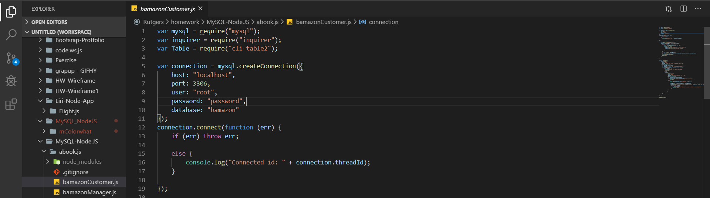

Display All Productions:

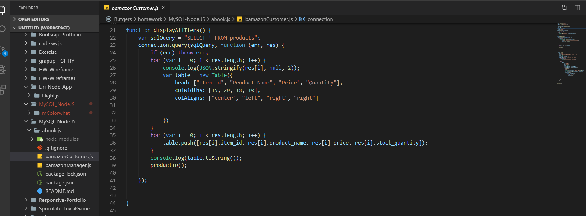

ProductID Function:

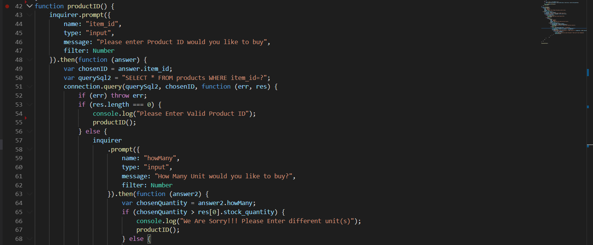

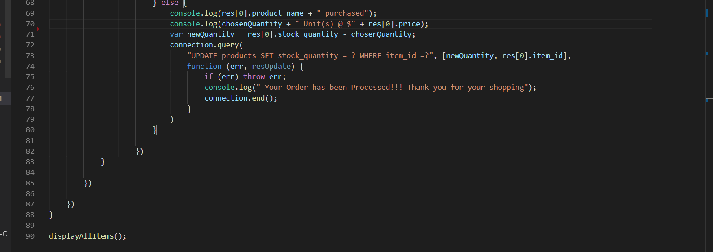

Running Application on Terminal:

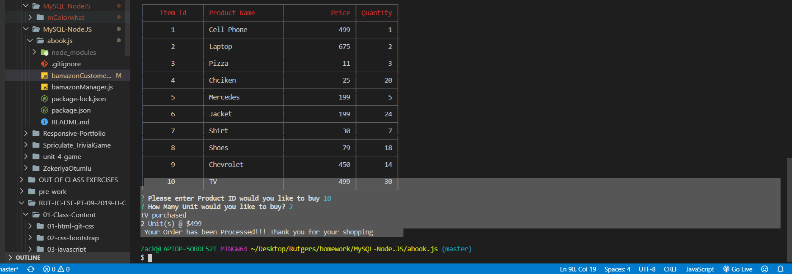

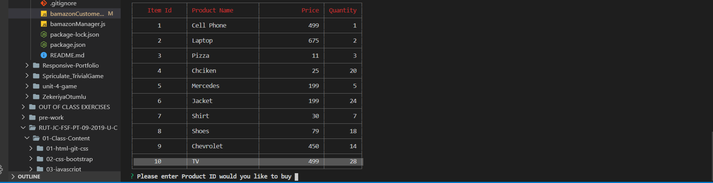

bamazonManager Page:

conncetions:
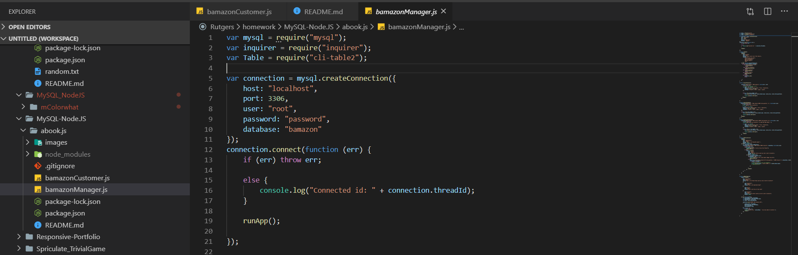

runApp Function:

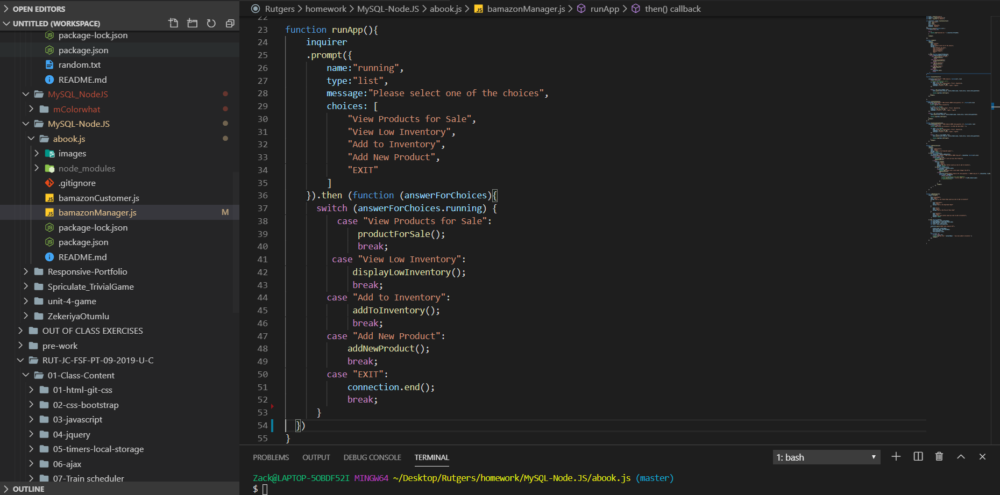

displayAllProducts Function:

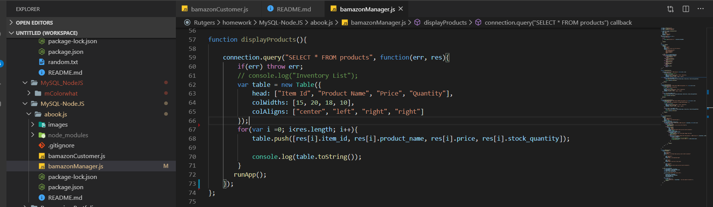

Products For Sale Function:

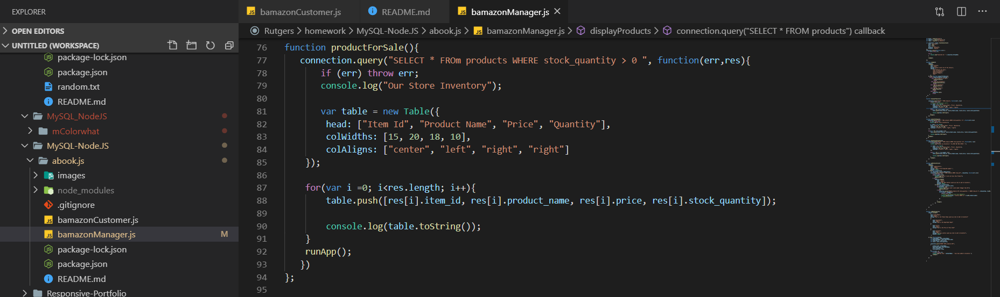

Display Low Inventory Function:

Add To Inventory Function:

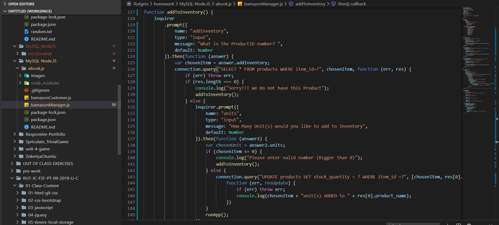

Add New Product Function:

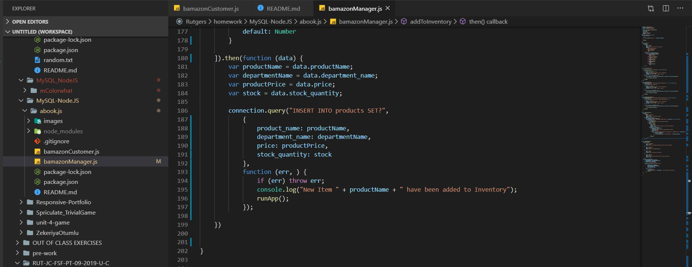

Run Application on Terminal:

1) Display Products For Sale:

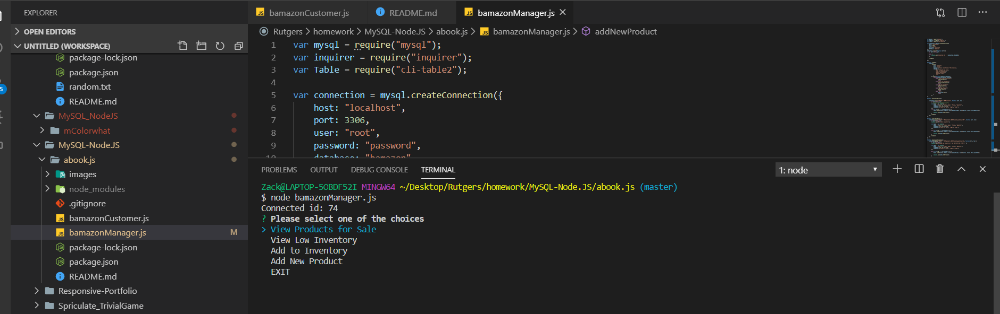

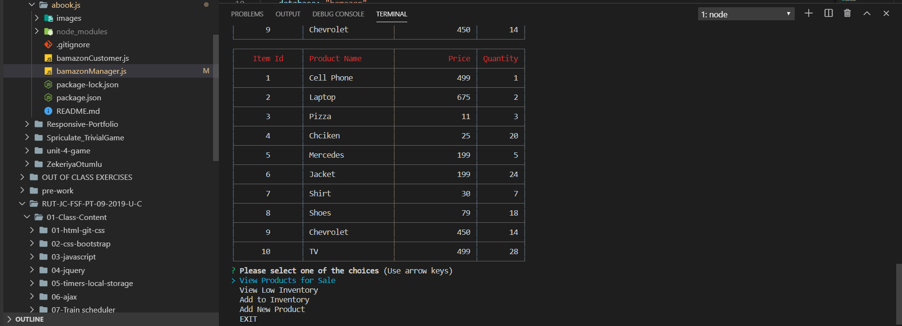

2) Display Low Inventory:

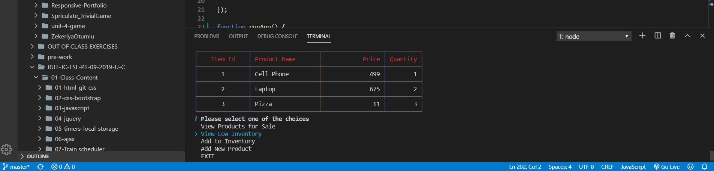

3) ADD To Inventory (Update Inventory):

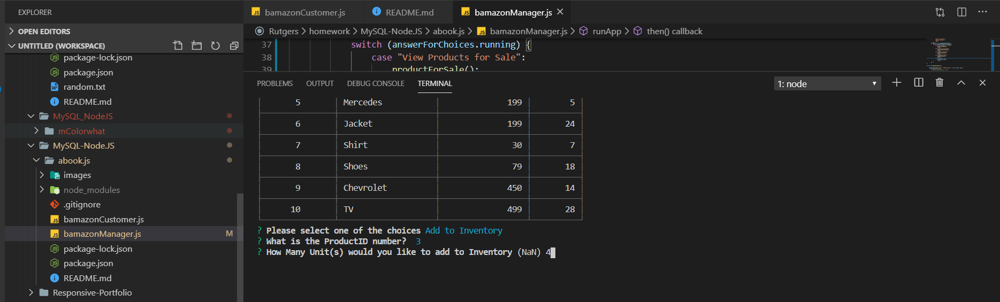

4) ADD New Product to Inventory:

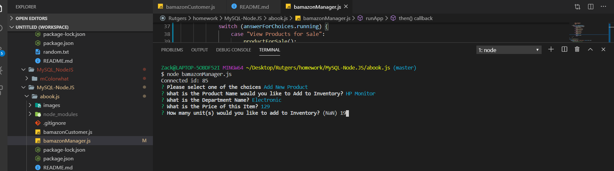

