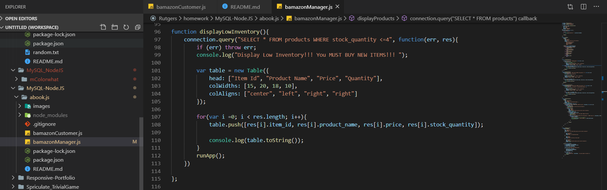

# abook.js
MySQL-Node.js

bamazonCustomer.js Page:

Connections:

Display All Productions:

ProductID Function:

Running Application on Terminal:

bamazonManager Page:

conncetions:

runApp Function:

displayAllProducts Function:

Products For Sale Function:

Display Low Inventory Function:

Add To Inventory Function:

Add New Product Function:

Run Application on Terminal:

1) Display Products For Sale:

2) Display Low Inventory:

3) ADD To Inventory (Update Inventory):

4) ADD New Product to Inventory:

